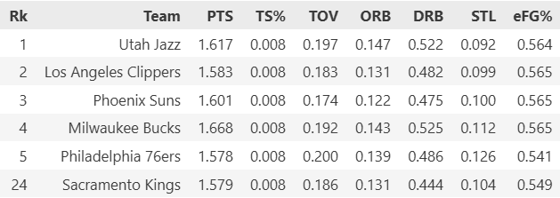
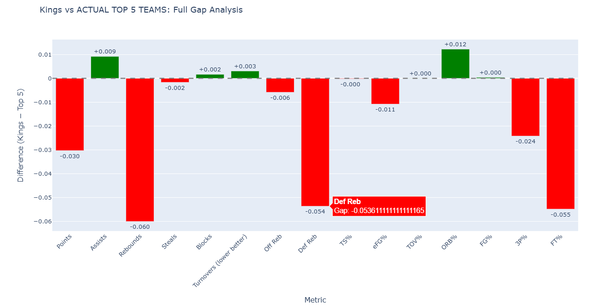
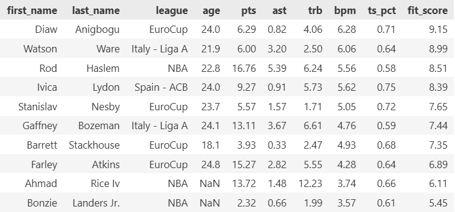
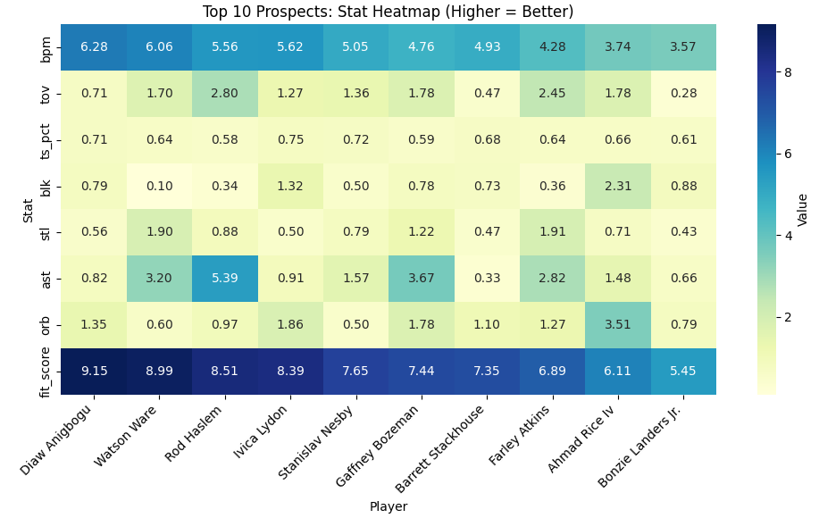

# Finding Hidden Gems: A Data-Driven Scouting Report for the Sacramento Kings

## Introduction

The Sacramento Kings haven't made the NBA playoffs since 2006—the longest active drought in professional sports. While the franchise has struggled with draft decisions and roster construction, one potential avenue for improvement lies in international scouting. International players offer tremendous value: they're often overlooked, cost-effective, and can fill specific roster gaps that traditional college prospects might not address.

This project combines real NBA data with mock international player statistics to demonstrate how data science can enhance basketball operations. Using web scraping, data cleaning, and exploratory analysis, I built a scouting report that identifies which international prospects best fit the Kings' roster needs from the 2020-21 season.

## The Question

**Can we use data to identify international prospects who specifically address the Sacramento Kings' weaknesses?**

Rather than simply finding the "best" players, I wanted to create a weighted fit score that matches prospects to the Kings' actual gaps in rebounding, playmaking, shooting efficiency, and overall impact.

## Ethical Data Collection

Before diving into the technical work, I ensured my data collection followed best practices:

- **Basketball-Reference.com's robots.txt**: I checked the site's scraping policies and confirmed that accessing team statistics pages is permitted
- **Respectful scraping**: I implemented delays between requests and used Selenium only when necessary (not for bulk operations)
- **Mock data for prospects**: My mentor provided anonymized international player statistics to simulate a real scouting database without privacy concerns
- **Public information only**: All NBA data scraped is publicly available team-level statistics

## The Web Scraping Challenge

Getting NBA data sounds straightforward—until you actually try it. Here's what I learned.

### Why Selenium Was Necessary

I initially attempted to scrape the [2020-21 Sacramento Kings page](https://www.basketball-reference.com/teams/SAC/2021.html) using Python's `requests` library and BeautifulSoup. This worked for basic tables like "Per Game Stats," but **Advanced Stats**—the metrics I needed most—were completely missing.

**The problem?** JavaScript lazy-loading.

Basketball-Reference doesn't load all tables in the initial HTML response. Instead, JavaScript runs after the page renders in a browser, dynamically injecting critical tables like Advanced Stats, Shooting Stats, and Play-by-Play data. When you use `requests.get()`, you only receive the initial HTML—before JavaScript executes. The table wrappers exist (like `<div id="all_advanced">`), but they're empty.

**The solution?** Selenium with Chrome WebDriver.

By launching a real browser, Selenium:
- Executes JavaScript just like a human visitor would
- Waits for DOM updates using `WebDriverWait`
- Captures the fully rendered HTML via `driver.page_source`
- Guarantees all 12 tables are present and parseable

```python
from selenium import webdriver
from selenium.webdriver.common.by import By
from selenium.webdriver.support.ui import WebDriverWait
from selenium.webdriver.support import expected_conditions as EC
from bs4 import BeautifulSoup

# Launch Chrome and load page
driver = webdriver.Chrome()
driver.get('https://www.basketball-reference.com/teams/SAC/2021.html')

# Wait for Advanced Stats table to load
WebDriverWait(driver, 10).until(
    EC.presence_of_element_located((By.ID, "all_advanced"))
)

# Parse fully rendered HTML
soup = BeautifulSoup(driver.page_source, 'html.parser')
```

**Trade-off**: Selenium is slower (~3-5 seconds per page) but achieves 100% accuracy. For this project, reliability mattered more than speed.

## Data Collection Steps

If you want to replicate this project, here's your roadmap:

1. **Set up your environment**
   - Install Selenium: `pip install selenium`
   - Download ChromeDriver matching your Chrome version
   - Install BeautifulSoup: `pip install beautifulsoup4`

2. **Scrape team data**
   - Target URLs: Team pages (e.g., `/teams/SAC/2021.html`) and league overview (`/leagues/NBA_2021.html`)
   - Use Selenium for JavaScript-heavy pages
   - Extract tables using BeautifulSoup's `find_all('table')`

3. **Clean and merge data**
   - Handle missing values using median imputation by season
   - Calculate per-game statistics from counting stats
   - Compute advanced metrics like True Shooting % (TS%)

4. **Prepare your prospect database**
   - Filter for players under 25 years old
   - Require minimum 10 games played per season
   - Aggregate multi-season data into career averages

## Building the Fit Score

This is where the project gets interesting. Instead of ranking players by raw talent, I created a **Kings-specific fit score** based on their 2020-21 weaknesses.

### Step 1: Identify Kings Weaknesses

I compared the Kings to the league's top 5 teams across 11 key metrics:
- Scoring (points per game)
- Playmaking (assists per game)  
- Rebounding (total rebounds per game)
- Overall impact (Box Plus/Minus)
- Efficiency (True Shooting %)
- Ball security (turnovers—lower is better)

### Step 2: Assign Priority Weights

Not all weaknesses matter equally. I assigned weights based on urgency:
- **Box Plus/Minus (20%)**: Overall impact is king
- **Rebounding (18%)**: The Kings were brutal on the boards
- **Assists (15%)**: Desperately needed playmaking
- **Turnovers (penalty)**: Lower turnovers = higher score

Weights sum to 1.0 for transparency and tunability.

### Step 3: Calculate Fit Scores

For each international prospect:
```
Fit Score = Σ (Player's stat × Kings need weight)
```

High scores indicate players who directly fill Sacramento's biggest holes—not just "good" players, but **the right** players.

## Key Findings

### The Sacramento Kings Were Below Average

Comparing the Kings to the league's top 5 teams revealed significant gaps:



The bar chart below visualizes where Sacramento struggled most:


*Rebounding and free throw percentage were critical weaknesses*

### Top 10 International Prospects

After running my fit score algorithm, these prospects emerged as the best matches for the Kings:


*Ranked by fit score—how well they address Kings weaknesses*

### Prospect Skill Profiles

The heatmap reveals each prospect's strengths:


*Darker colors indicate stronger performance in each category*

### Head-to-Head Comparison

How do these prospects stack up against the 2020-21 Kings roster?


*Normalized comparison shows where prospects exceed Kings averages*

The top prospects consistently outperformed Sacramento in rebounding, defensive impact (BPM), and shooting efficiency—exactly what the team needed.

## Technical Challenges and Solutions

**Challenge #1**: JavaScript-loaded content  
**Solution**: Switched from `requests` to Selenium

**Challenge #2**: Inconsistent data formats across seasons  
**Solution**: Median imputation by season context

**Challenge #3**: Avoiding division-by-zero errors in league comparisons  
**Solution**: Built fit scores using absolute values and weights instead of ratios

**Challenge #4**: Handling missing Box Plus/Minus data  
**Solution**: Used player-level averages for Kings; neutral 0.0 for league baseline

## Conclusion

This project demonstrates how data science can enhance basketball scouting beyond traditional "eye test" evaluations. By combining web scraping, statistical analysis, and domain knowledge, I identified international prospects who specifically address the Sacramento Kings' weaknesses—something generic "best available player" rankings can't do.

The methodology is transferable: change the team, adjust the weights, update the season, and you have a new scouting report. That's the power of reproducible data science.

## Resources and Links

- **Full code repository**: [GitHub - Kings Scouting Report](https://github.com/cottonjenn/data_science_project_sep_2025)
- **Basketball-Reference**: [Team Stats](https://www.basketball-reference.com/teams/SAC/2021.html) / [League Stats](https://www.basketball-reference.com/leagues/NBA_2021.html)
- **Selenium Documentation**: [Getting Started](https://selenium-python.readthedocs.io/)
- **BeautifulSoup Tutorial**: [Web Scraping Guide](https://www.crummy.com/software/BeautifulSoup/bs4/doc/)


